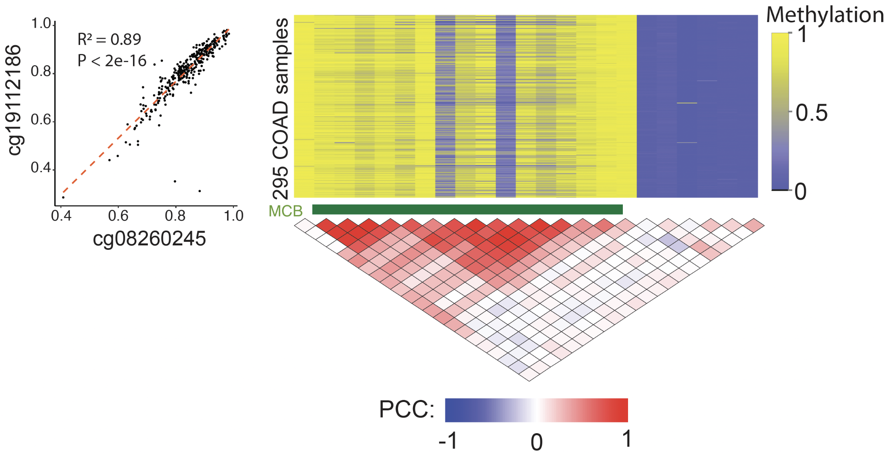
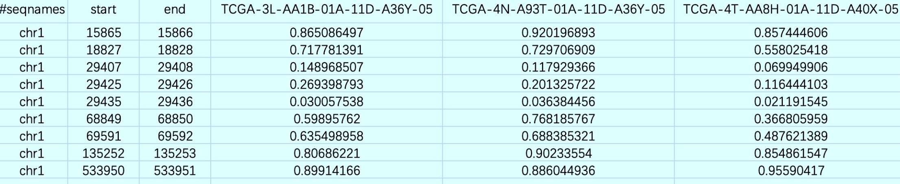
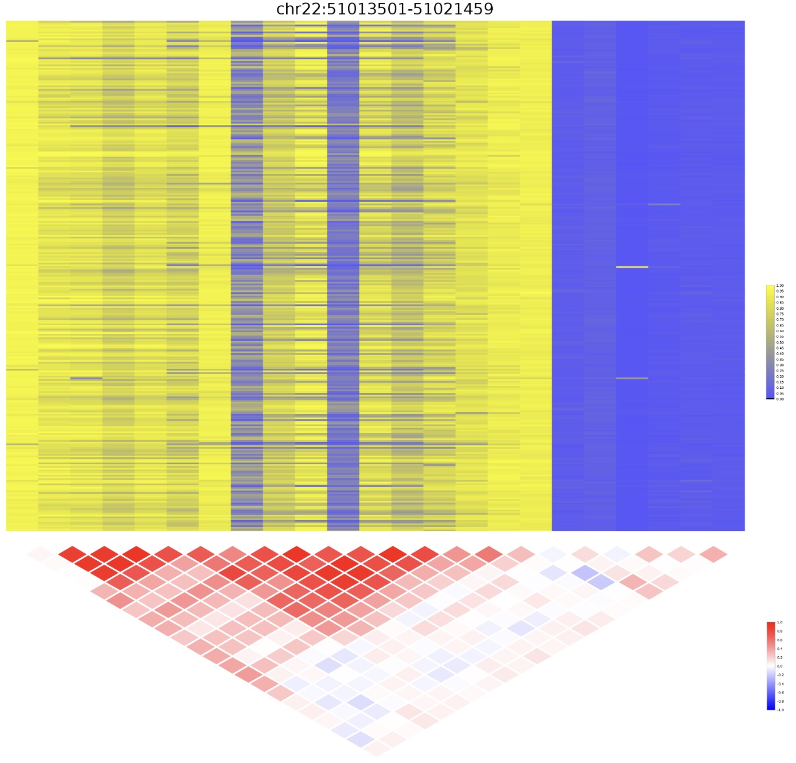

## Introduction
mcbTK is a tool kit for analysis of methylation-correlated blocks (MCBs) from microarray data, such as the Infinium HumanMethylation450 BeadChip. The input format was designed to be general and indexed using Tabix for random and fast access. This allows mcbTK to be applied to methylation data from other platforms, including WGBS, RRBS and targeted BS-seq. MCBs were identified as regions of tightly co-methylated CpG sites across multiple samples.

## Inputs
### DNA methylation matrix
Unlike other matrices, the user needs to specify the genomic position of each CpG site in the first three columns, with columns 4 to the last containing the mean methylation levels of each CpG. As shown in the example below, a header is required to store the sample names.



Then this matirx file can be indexed using Tabix:

```
cat Methylation_matrix | bgzip > Methylation_matrix.gz
tabix -b 2 -e 3 Methylation_matrix.gz
```

### other files
- [BED files](https://genome.ucsc.edu/FAQ/FAQformat.html)
- sample ID file, a text file with one sample ID per line

## Manual
There are 6 modules in mcbTK, with a focus on identification and characterization of MCBs from methylation array data.

```
mcbTK: a Java toolkit for the analysis of methylation-correlated blocks
Usage: java -jar mcbTK <command> [options]

  Commands:
  MCBDiscovery  identification of MCBs
  VMRDiscovery  identification of VMRs
  mcbView       show correlation of CpG methylation in a region
  stat          calculate summary statistics of CpG methylation across samples
  rxs           calculate summary statistics of CpG methylation in each sample
  R2            calculate correlation of CpG methylation in a region
  CSN           build sample-specific networks
```

### MCBDiscovery
This module identifies methylation-correlated blocks and is the main function of mcbTK package.

```
java -jar mcbTK-1.0-jar-with-dependencies.jar MCBDiscovery -h
  -bed,--bed <arg>             a BED file
  -distance,--distance <arg>   maximum distance between two CpG sites [1000]
  -h,--help                    help
  -input,--input <arg>         input file
  -nSample,--nSample <arg>     minimal number of samples requred for R calculation [20]
  -output,--output <arg>       prefix of the output file(s) [MCBDiscovery]
  -pvalue,--pvalue <arg>       p value cutoff [0.05]
  -R,--R <arg>                 R cutoff [0.8]
  -sampleID,--sampleID <arg>   sampleID file in text format, one sample ID per line
  -window,--window <arg>       size of window [3]
```

An example command line:
```
java -jar mcbTK-1.0-jar-with-dependencies.jar MCBDiscovery -input data/COAD_T.gz -nSample 20 -R 0.8 -pvalue 0.05 -window 3 -distance 1000 -output COAD_T
```

The identified MCBs can be found in `COAD_T.txt` (the first few lines):
```
chr1	942161	942295
chr1	942295	942498
chr1	949449	949893
chr1	976168	976227
chr1	1003126	1003529
chr1	1063527	1064122
chr1	1097027	1097270
chr1	1098900	1099651
chr1	1100035	1100493
chr1	1102276	1102417
```


### VMRDiscovery
This module identifies variable methylation regions and is the main function of mcbTK package.

```
java -jar mcbTK-1.0-jar-with-dependencies.jar MCBDiscovery -h
  -input,--input <arg>                input file
  -nSample,--nSample <arg>            minimal number of samples requred for R calculation [20]
  -percentile,--percentile <arg>      the percentile cutoff of CpG SD value [95]
  -rate,--rate <arg>                  the rate of CpG that SD in top 95 perpercentile [0.5]
  -distance,--distance <arg>          size of slide window [1000]
  -output,--output <arg>              output file
```

An example command line:
```
java -jar mcbTK-1.0-jar-with-dependencies.jar VMRDiscovery -input data/COAD_T.gz -nSample 20 -percentile 95 -rate 0.5 -distance 1000 -output COAD_T
```

The identified MCBs can be found in `COAD_T.txt` (the first few lines):
```
chr1	967967	968558
chr1	1181769	1182424
chr1	1566699	1567820
chr1	2375010	2375627
chr1	2559930	2560950
chr1	2984631	2987347
chr1	3568124	3568245
chr1	6239475	6241070
chr1	12655240	12656315
chr1	13909821	13910700
```


### mcbView
```
java -jar mcbTK-1.0-jar-with-dependencies.jar mcbView -h
usage: Options
  -h,--help                      help
  -input,--input <arg>           input file
  -nSample,--nSample <arg>       minimal number of samples requred for R calculation [20]
  -outFormat,--outFormat <arg>   output format, pdf or png [pdf]
  -region,--region <arg>         one region, in the format of chr:start-end
  -sampleID,--sampleID <arg>     sampleID file in text format, one sample ID per line
```

```
java -jar mcbTK-1.0-jar-with-dependencies.jar mcbView -input data/COAD_T.gz -region chr22:51013501-51021459 -outFormat png
```




### stat
This function summerizes CpG methylation levels across samples and report the average summary statistics (mean, median, variation) in pre-defined regions.

```
java -jar mcbTK-1.0-jar-with-dependencies.jar stat -h
usage: Options
  -bed,--bed <arg>             a BED file
  -h,--help                    help
  -input,--input <arg>         input file
  -metrics,--metrics <arg>     stat metrics, including mean, median, var
  -output,--output <arg>       prefix of the output file(s) [Stat]
  -sampleID,--sampleID <arg>   sampleID file in text format, one sample ID per line
```

```
java -jar mcbTK-1.0-jar-with-dependencies.jar stat -input data/COAD_T.gz -bed data/hg19_cpgisland_1000.bed -metrics mean var -output COAD_T
```

```
chrom   start   end     cov     mean    var
chr1    28735   29810   3       0.0867366534609302      0.001241793550465535
chr1    135124  135563  1       0.7950712854140782      0.0023377409998143477
chr1    533219  534114  1       0.9271242179589857      6.867367724947415E-4
chr1    713984  714547  3       0.05283850853875834     0.0012933746090711298
chr1    762416  763445  7       0.027627425185397594    6.301322946940301E-4
chr1    788863  789211  1       0.9152198698060524      9.87540105123994E-4
chr1    805198  805628  3       0.25015609257542515     0.007923673675253482
chr1    839694  840619  3       0.07392456802184665     0.0038712941482810337
chr1    844299  845883  2       0.6701702410589834      0.018213480613662854
```

### rxs
This function summerizes CpG methylation levels in predefined regions and reports the results across all samples as a table.

```
java -jar mcbTK-1.0-jar-with-dependencies.jar rxs -h
usage: Options
  -bed,--bed <arg>             a BED file
  -h,--help                    help
  -input,--input <arg>         input file
  -metrics,--metrics <arg>     a stat metric, can be one of mean, median or var
  -output,--output <arg>       prefix of the output file(s) [Rxs]
  -sampleID,--sampleID <arg>   sampleID file in text format, one sample ID per line
```


```
java -jar mcbTK-1.0-jar-with-dependencies.jar rxs -input data/COAD_T.gz -bed data/hg19_cpgisland_1000.bed -metrics mean -sampleID sampleID_T3.txt -output COAD_rxs
```

The command line above calculates mean methylation in genomic regions defined in a BED file 'hg19_cpgisland_1000.bed' across samples defined in 'sampleID_T3.txt'.

```
chrom   start   end     cov     TCGA-3L-AA1B-01A-11D-A36Y-05    TCGA-4N-A93T-01A-11D-A36Y-05    TCGA-4T-AA8H-01A-11D-A40X-05
chr1    28735   29810   3       0.14947494611168907     0.11854651457786183     0.06919518456821853
chr1    135124  135563  1       0.806862209528145       0.90233554031985        0.854861546515846
chr1    533219  534114  1       0.899141659805381       0.88604493635266        0.955904170144673
chr1    713984  714547  3       0.0505007586547684      0.0540620399269678      0.10984988821972523
chr1    762416  763445  7       0.04326560961995017     0.029316052873034498    0.027903355505161657
chr1    788863  789211  1       0.889704573585828       0.914117967308792       0.878462040709895
chr1    805198  805628  3       0.341236460115017       0.297215833271494       0.14795536958001887
chr1    839694  840619  3       0.0750006690115382      0.08604305216133616     0.07683963309525094
chr1    844299  845883  2       0.4657645859757985      0.5662710805539165      0.761475587731713
```

### R2
This function calcuates Pearson correlation coefficient (R) between pairwise CpG sites in predefined regions.

```
java -jar mcbTK-1.0-jar-with-dependencies.jar R -h
usage: Options
 -bed,--bed <arg>             a BED file
 -h,--help                    help
 -input,--input <arg>         input file
 -nSample,--nSample <arg>     minimal number of samples requred for R calculation [20]
 -output,--output <arg>       prefix of the output file(s) [R]
 -region,--region <arg>       one region, in the format of chr:start-end
 -sampleID,--sampleID <arg>   sampleID file in text format, one sample ID per line
```

```
snode040$ java -jar mcbTK-1.0-jar-with-dependencies.jar R -input data/COAD_T.gz -region chr1:942161-942295
```

```
chr1    942161  942198  0.9582343581702952
chr1    942161  942295  0.942037557110885
chr1    942198  942295  0.9270039521770942
```

### CSN
The [CSN method](https://academic.oup.com/nar/article/47/11/e62/5377474) was firstly introducted to identify cell-specific network (CSN) for each single cell from scRNA-seq data. Here, we use this method to build CSNs using methylation in CpG islands or MCBs.

```
java -jar mcbTK-1.0-jar-with-dependencies.jar CSN -h
usage: Options
  -alpha,--alpha <arg>           Significant level [0.01]
  -bed,--bed <arg>               a BED file
  -boxSize,--boxSize <arg>       Size of neighborhood [0.1]
  -h,--help                      help
  -input,--input <arg>           input file
  -ndmFlag,--ndmFlag             whether generate NDM matrix
  -outputDir,--outputDir <arg>   output directory, created in advance
  -tag,--tag <arg>               prefix of the output file(s)
```

## Citation
